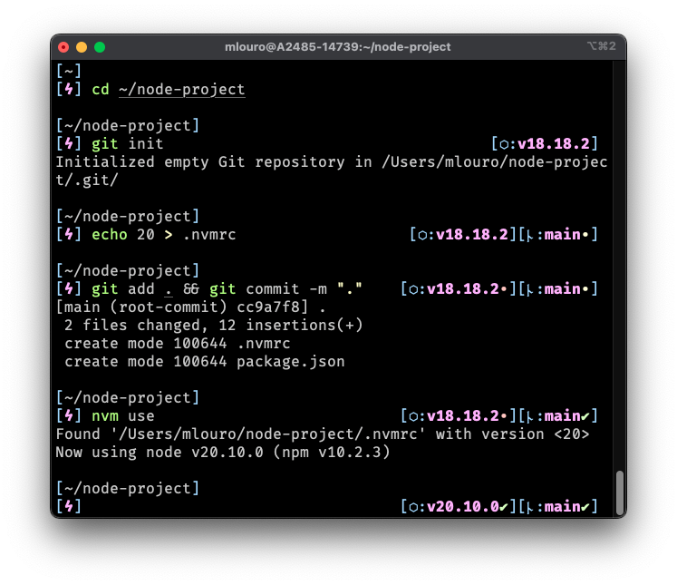

# zshiggy ⚡️

An `oh-my-zsh` theme inspired by the [`frontcube`](https://github.com/ohmyzsh/ohmyzsh/blob/master/themes/frontcube.zsh-theme) theme's layout.



**Requirements:**
- `zsh` & `oh-my-zsh` (duh)
- Node.js (kinda)
	- A `node -v` is ran when a Node project (package.json) is detected in your current directory. You can disable this with `ZSHIGGY_NODE_ENABLED=false`.

**Features include:**
- Current Git branch, clean/dirty status, and commits behind/ahead from remote.
- Node.js project support; displays current version if a Node project is detected.
- Configurable env variables to modify displayed content and turn features on/off.

## Install

**Step 1:** Clone the repo; wherever you want.

```bash
git clone https://github.com/malouro/zshiggy.git
```

**Step 2:** Create symbolic link to the `oh-my-zsh` theme folder.

```bash
ln -s $REPO_LOCATION_FROM_STEP_1/zshiggy.zsh-theme $HOME/.oh-my-zsh/themes/zshiggy.zsh-theme
```

**Step 3:** Update your config.

In your `.zshrc` config (probably in `$HOME/.zshrc`) update/add this:

```sh
ZSH_THEME="zshiggy"
```

> Alternatively, you can just download this repo as a zip, and move the `zshiggy.zsh-theme` file directly into the `oh-my-zsh` themes folder location shown in Step 2.

## Configuration

The following environment variables are used by the theme to control certain elements and features:

| Variable | Description | Default |
|----------|-------------|---------|
| `ZSHIGGY_SYMBOL`       | Symbol that displays before cursor in console | `ϟ` |
| `ZSHIGGY_GIT_ENABLED`  | Enables Git features | `true` |
| `ZSHIGGY_GIT_SYMBOL`   | Symbol that displays before Git branch name | `ᚿ` |
| `ZSHIGGY_NODE_ENABLED` | Enables Node.js features (if you're not using Node or if it's slowing down `zsh` startup, you can set this to `false`) | `true` |
| `ZSHIGGY_NODE_SYMBOL`  | Symbol that displays before Node version info | `⬡` |

Add & modify any of the above into your `.zshrc` or `oh-my-zsh` config to your liking.
